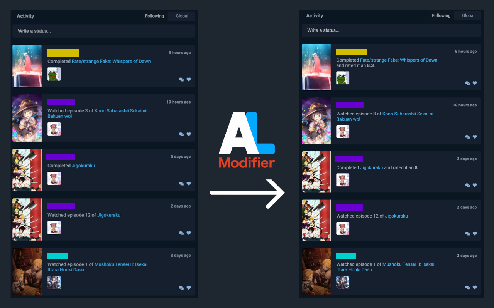

# AniList Modifier

This is a chrome extension to improve your experience using [AniList Homepage](https://anilist.co/home).

**Features**:
- ⭐ Adds scores to user activity when completing or dropping anime and manga
  - Works for all rating types whether they are scaled up to 10 or 100, or the 5 star or smiley face system
- 🎨 Color codes ratings both in the activity feed and media lists
  - Colors can be calculated automatically or customised to your preference
- ⏫ Automatically scrolls to top of page when the activity feed does not populate
- 💎 All features can be enabled or disabled independently via the settings page

## Download

The tool is currently available in the chrome extension store and you can install it [here](https://chrome.google.com/webstore/detail/anilist-modifier/knclmpfhlbdlndgplhbnpajhpjmklfpi).

You may also compile the most recent version yourself if you prefer. To do this you will need to download or clone this repository, and then run:

- `npm install` or `yarn install`
- `npm build` or `yarn build`

This will compile the typescript and move all necessary files to the `build/` folder. This folder can then be installed as an extension by enabling developer mode on the extensions tab. Click [here](https://webkul.com/blog/how-to-install-the-unpacked-extension-in-chrome/) for further instructions if needed.
